# JAVASCRIPT

Notes de cours provisoires

Basées notamment sur :

- Le tutoriel d'Openclassroom "Apprenez à coder avec JavaScript" (20 heures, facile) : https://openclassrooms.com/fr/courses/2984401-apprenez-a-coder-avec-javascript, en grande partie ;
- Le livre « Javascript pour les Web Designers » de Mat Marquis, Collection A Book Apart n° 20 aux Éditions Eyrolles, dans une moindre mesure.

# Partie 1 - Écrire ses premières lignes de code

## 6. Répétez des instructions

Par défaut, toutes les instructions d’un programme (à part les commentaires) sont toutes exécutées, dans l'ordre du code, sauf quand on contrôle cela avec des structures de contrôle :

- dans le chapitre 5, nous avons vu les **tests**, qui créent des branchements (on exécute certaines lignes de code et pas d'autres selon qu'une condition est vérifiée ou pas) ;
- dans ce chapitre 6, nous allons voir les **boucles**, qui permettent de répéter plusieurs fois une ou plusieurs lignes d'instructions (tant qu'une condition d'arrêt n'est pas remplie) avant de passer à la suite du code.

### 6.0. Introduction

Essayons d'écrire un programme qui affiche tous les nombres entre 1 et 5. Voici ce que nous pouvons écrire avec nos connaissances actuelles :

JS offre la possibilité de répéter l'exécution d'un ensemble d'instructions en plaçant ces instructions à l'intérieur d'une **boucle**. À chaque répétition, les instructions contenues dans la boucle sont exécutées. C'est ce qu'on appelle un **tour de boucle** ou encore une **itération**.

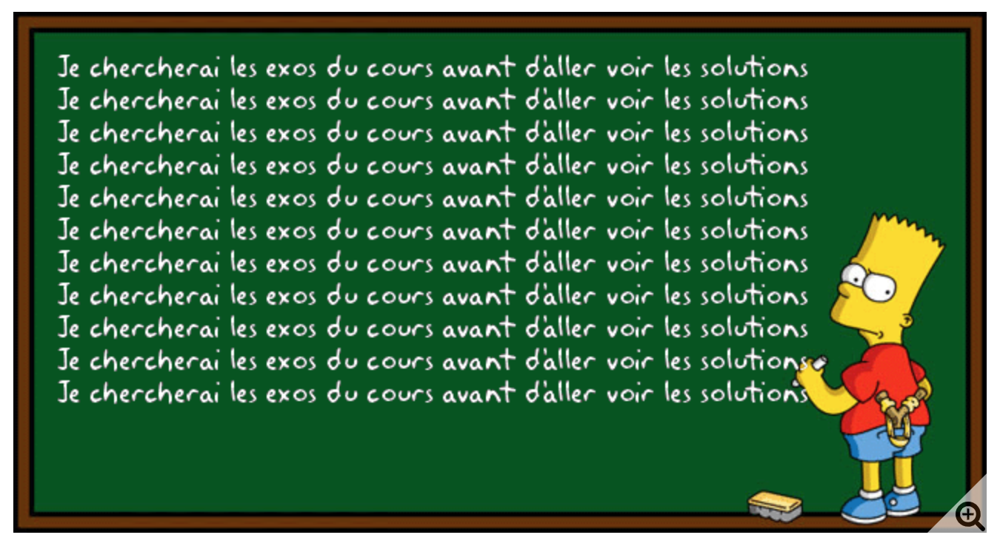

Le nombre de répétitions peut être connu à l'avance ou dépendre de l'évaluation d'une condition.

Il y a deux manières d'écrire une boucle : la boucle **while** et la boucle **for**.

### 6.1. La boucle for

#### Exemple d'utilisation

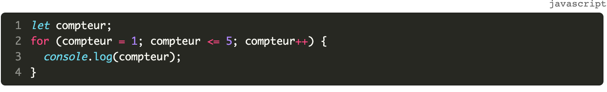

#### Fonctionnement

La syntaxe de l'instruction for est la suivante.

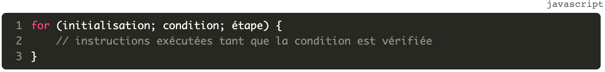

La boucle for est composée de trois **instructions**, regroupées dans la parenthèse du `for`, et qui sont donc séparées par un `;` :

- **initialisation** : on initialise un compteur pour dire OÙ ON COMMENCE ;
- **condition** : on écrit une condition sur le compteur pour dire QUAND ON S'ARRÊTE ;
- **étape** (ou **incrémentation**) : on incrémente le compteur pour dire COMMENT ON AVANCE dans la boucle.

L'initialisation se produit une seule fois, au début de l'exécution.

La condition est évaluée *avant* chaque tour de boucle. Si elle est vraie, un nouveau tour de boucle est effectué. Sinon, la boucle est terminée.

L'étape (ou incrémentation)  est réalisée *après* chaque tour de boucle.

Le plus souvent, on utilise l'initialisation pour définir la valeur initiale d'une variable qui sera impliquée dans la condition de la boucle. L'étape sert à modifier la valeur de cette variable.

#### Compteur de boucle

La variable utilisée dans l'initialisation, la condition et l'étape d'une boucle for est appelée le **compteur** de la boucle.

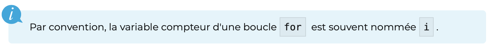

Très souvent,  on n'a pas besoin d'utiliser la variable compteur en dehors du corps de la boucle. Dans ce cas, on peut la déclarer en même temps qu'on l'initialise dans la boucle. Notre programme d'exemple peut être réécrit ainsi :

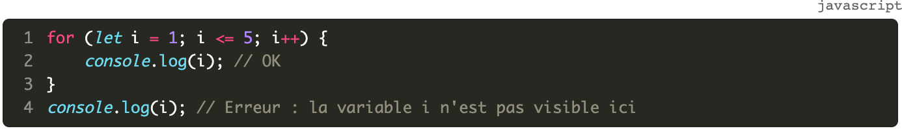

#### La table d'évolution des variables

| i       | i < = 5         | console.log(i)        | i++               |
| ------- | --------------- | --------------------- | ----------------- |
| i = 1   | 1 <= 5 **true** |  affiche 1            | i passe à 1+1 = 2 |
| i = 2   | 2 <= 5 **true** |  affiche 2            | i passe à 2+1 = 3 |
| i = 3   | 3 <= 5 **true** |  affiche 3            | i passe à 3+1 = 4 |
| i = 4   | 4 <= 5 **true** |  affiche 4            | i passe à 4+1 = 5 |
| i = 5   | 5 <= 5 **true** |  affiche 5            | i passe à 5+1 = 6 |
| i = 6   | 6 <= 5 **FALSE**|  on sort de la boucle ! |                 |

### 6.2. La boucle while

La boucle `while` permet de répéter des instructions **tant qu'une condition est vérifiée**.

#### Exemple d'utilisation

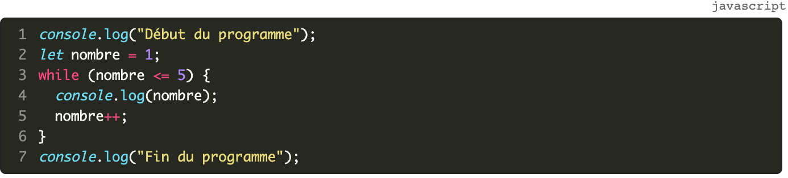
 
#### Fonctionnement

La syntaxe de l'instruction `while` est la suivante.

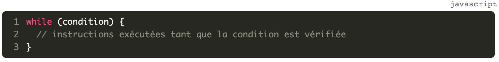

Avant chaque tour de boucle, la condition associée au `while` est évaluée.

- Si elle est vraie, les instructions du bloc de code associé au `while` sont exécutées. Ensuite, l'exécution revient au niveau du `while` et la condition est à nouveau vérifiée ;
- Si elle est fausse, les instructions du bloc ne sont pas exécutées et le programme continue juste après le bloc `while`.

Le bloc d'instructions associé à une boucle est appelé le **corps de la boucle**.

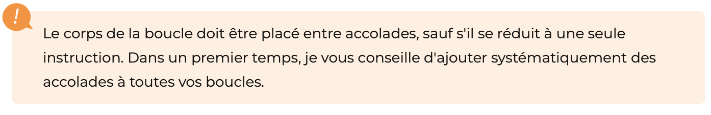

### 6.3. Erreurs fréquentes

#### Boucle while infinie

Le principal risque lié à la boucle `while` est la *« boucle infinie »*. Il s'agit d'une erreur de programmation très facile à commettre, donc dangereuse.

Modifiez l'exemple de boucle `while` en oubliant volontairement la ligne qui incrémente la variable `nombre`.

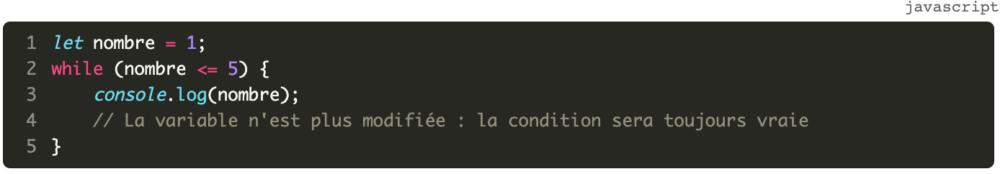

Lors de l'exécution de ce programme, on effectue un premier tour de boucle puisque la condition `nombre <= 5` est initialement vérifiée. Mais comme on ne modifie plus la variable `nombre` dans le corps de la boucle, la condition est indéfiniment vraie : il s'agit d'une **boucle infinie**.

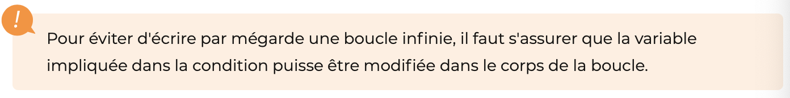

#### Manipulation du compteur d'une boucle for

Imaginons qu'un accès de folie temporaire vous conduise à modifier le compteur d'une boucle `for` dans le corps de la boucle, comme dans l'exemple suivant.

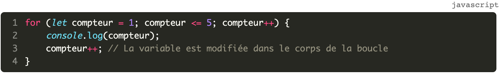

Si vous faites cela, à chaque tour de boucle, la variable `compteur` sera incrémentée deux fois : dans le corps de la boucle, puis dans l'étape exécutée à la fin de chaque tour.

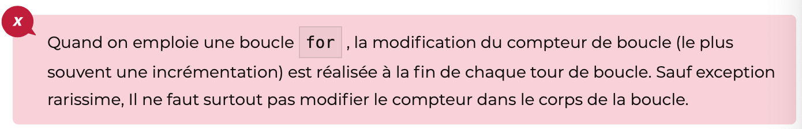

### 6.4. Choix entre un while et un for

Comment choisir le type de boucle à utiliser lorsqu'on doit répéter des instructions dans un programme ?

Toutes les boucles peuvent s'écrire avec un `while`.

En fait, `while` est la boucle la plus générale.

`for` est juste une écriture plus pratique lorsqu'on connaît à l'avance le nombre d'itérations.

- Si on peut prévoir à l'avance le nombre de tours de boucles à effectuer, la boucle `for` est le meilleur choix (parce que la boucle `for` a l'avantage d'intégrer la modification du compteur dans sa syntaxe, ce qui élimine le problème des boucles infinies. Mais son utilisation implique que le nombre de tours de boucle soit connu à l'avance… ;
- Si on ne peut pas prévoir à l'avance le nombre de tours de boucles à effectuer, il vaut mieux utiliser le `while`. C'est notamment le cas lorsque la boucle sert à contrôler une donnée saisie par l'utilisateur, comme dans cet exemple.

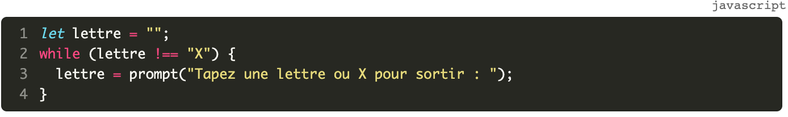

Le nombre de tours de boucle dépend des valeurs saisies par l'utilisateur : il est imprévisible.

En conclusion, le choix entre un `while` et un `for` dépend du contexte. Si on peut prévoir à l'avance le nombre de tours de boucles à effectuer, la boucle `for` est le meilleur choix. Sinon, il vaut mieux utiliser le `while`.

### 6.5. Des boucles imbriquées

On peut très bien imbriquer une boucle dans une boucle, comme ceci :

	for (let i=1; i <= 2 ; i++) {
		for (let j=1; j <= 3 ; j++) {
			console.log(i,j);
		}
	}

#### Pricnipe

C'est

- **d'abord** la boucle *interne* qui boucle :  
  c'est la boucle interne, donc ici la boucle sur `j`, qui boucle le plus vite ;
- **et puis** la boucle *externe* :
  c'est la boucle externe, donc ici la boucle sur `i`,  qui boucle le plus lentement.

#### Table d'évolution des variables

Pour vous rendre compte de ce qui se passe, faites la table d'évolution des variables :

| i       | i <= 2         | j       | j <= 3        | console.log(i, j)        | j++               | i++               | 
| ------- | --------------- | ------- | --------------- | --------------------- | ----------------- | ------- |
| i = 1   | 1 <= 2 **true** |  j = 1   | 1 <= 3 **true** | affiche 1, 1 | j passe à 1+1=2    | i reste à 1  | 
| i = 1   | 1 <= 2 **true** |  j = 2   | 2 <= 3 **true** | affiche 1, 2 | j passe à 2+1=3 | i reste à 1  | 
| i = 1   | 1 <= 2 **true** |  j = 3   | 3 <= 3 **true** | affiche 1, 3 | j passe à 3+1=4 | i reste à 1  |
| i = 1   | 1 <= 2 **true** |  j = 4   | 4 <= 3 **FALSE** | on sort de la boucle j et on retourne dans la boucle i |  | i passe à 1+1=2 |
| i = 2   | 2 <= 2 **true** |  j = 1   | 1 <= 3 **true** | affiche 2, 1 | j passe à 1+1=2    | i reste à 2  | 
| i = 2   | 2 <= 2 **true** |  j = 2   | 2 <= 3 **true** | affiche 2, 2 | j passe à 2+1=3    | i reste à 2  | 
| i = 2   | 2 <= 2 **true** |  j = 3   | 3 <= 3 **true** | affiche 2, 3 | j passe à 3+1=4    | i reste à 2  |
| i = 2   | 2 <= 2 **true** |  j = 4   | 4 <= 3 **FALSE** | on sort de la boucle j et on retourne dans la boucle i|     | i passe à 2+1=3  |
| i = 3   | 3 <= 2 **FALSE** |   |  | on sort de la boucle i |     |  |

### 6.6. À vous de jouer !

- Tournez manège
- Table de multiplication
- FizzBuzz

### 6.7. TL;DR : Résumons !

- On utilise une **boucle** pour exécuter plusieurs fois un bloc d'instructions.
- Chaque exécution est appelée un tour de boucle ou encore une **itération**.
- Le bloc d'instructions associé à une boucle est appelé le **corps de la boucle**.
- La boucle `while`permet de répéter des instructions tant qu'une condition est vérifiée.
- La boucle `for` ajoute la possibilité d'effectuer un traitement à l'entrée dans la boucle (initialisation) et après chaque tour de boucle (étape).
- La variable utilisée dans l'initialisation, la condition et l'étape d'une boucle `for` est appelée le **compteur** de la boucle.
- Il faut toujours que la condition d'une boucle `while` puisse devenir fausse afin d'éviter le risque d'une boucle infinie.
- On s'interdit de manipuler le compteur d'une boucle `for` à l'intérieur du corps de la boucle.

Toutes les boucles peuvent s'écrire avec un `while`. La boucle `for` est à privilégier lorsque le nombre d'itérations est connu à l'avance. 

